# Lab 3: Mobile Ingest with Larix to Wowza

In this lab, we use mobile phone as our camera for **live stream**. The stream will be directed to a media server, that is running **Wowza Streaming Engine**. We will test the stream quality with VLC and web browser.

### 1. Download and install software needed

1. Install [Larix Broadcaster](https://softvelum.com/larix/) on your smartphone. If you don't have it already, download and install [VLC](https://www.videolan.org) for your laptop.

### 2. Larix setup

1. Open **Larix Broadcaster** on your phone. Click the wheel to access settings. 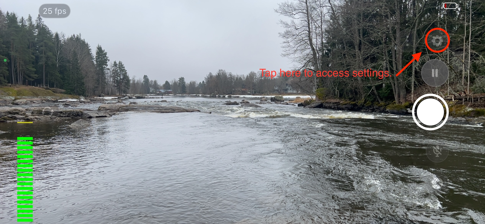

2. Click the **plus-symbol** to create a new connection. 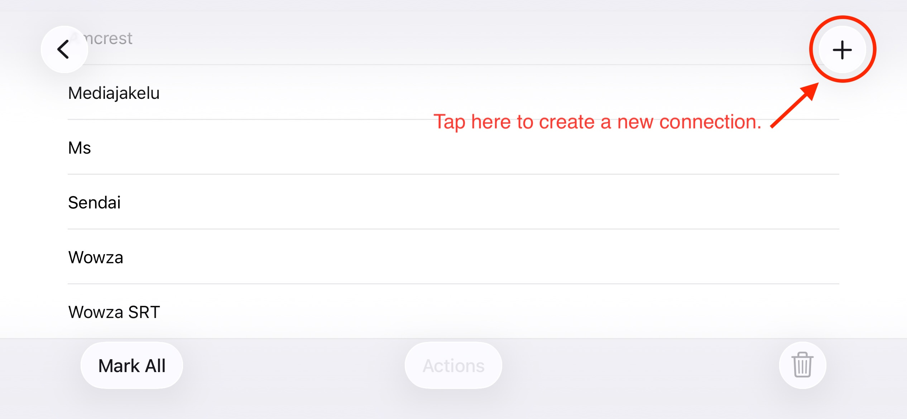
    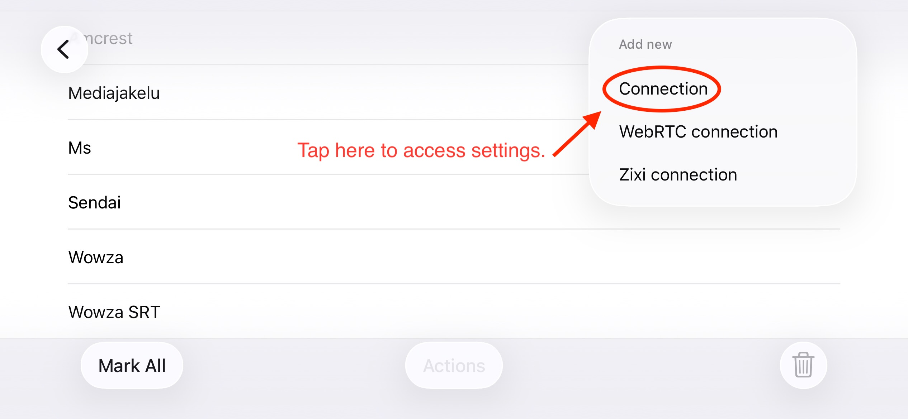
3. Fill in the following details:
    - Name: [name for your connection]
    - URL: `rtmp://[IP-Address]:1935/[ApplicationName]/[Your_stream_name_here]` Choose a unique name for your stream, so it differs from other groups. **Note:** URL is case-sensitive.
    - Target type: RTMP authorization
    - Login and password given by the teacher.
      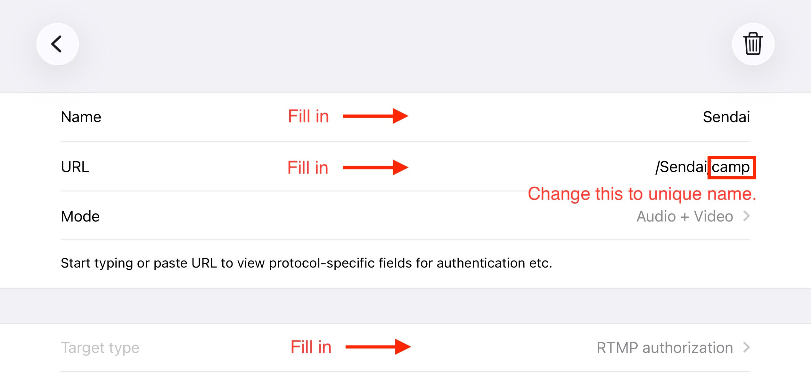
      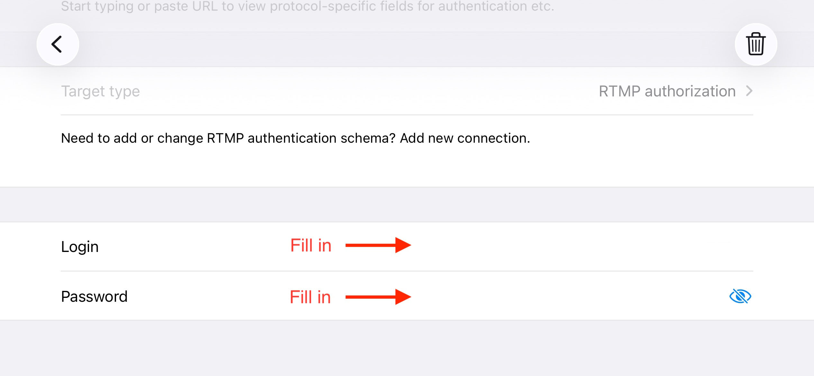

4. Tap the Back-button, until you get back to the screen where you can choose the connections. Choose your newly created connection, and hit back to get back on the recording screen.
    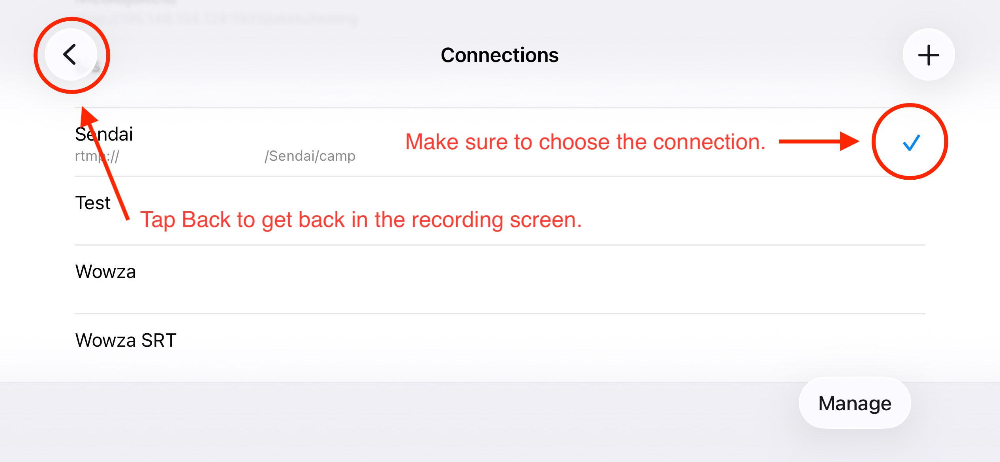

### 3. Verification (Wowza & VLC)

1. Open your favorite browser, and open a new **private** window. Login to the Wowza UI. Username and password are the same as with setting up the stream.
   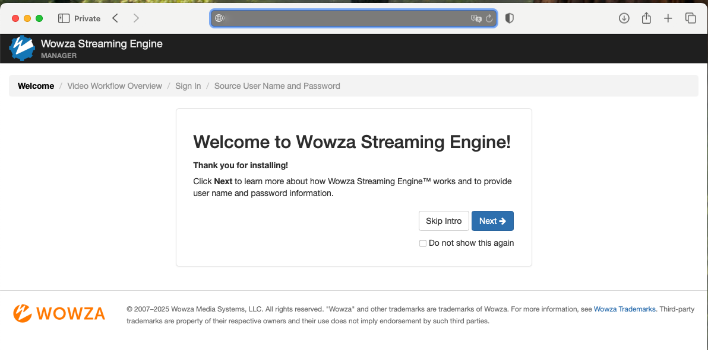
2. Click "Application" first, then choose your application "Sendai" and choose "Incoming Streams". Incoming streams shows server ingesting video stream (none right now).
   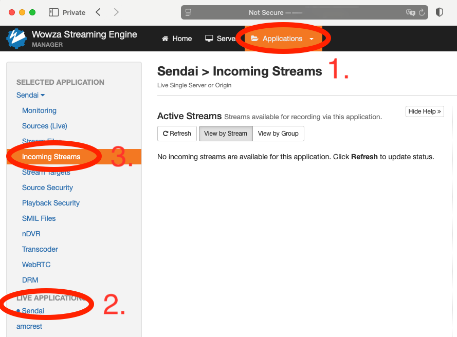
3. Pick up your phone, and in **Larix** press the **Record**-button. Check that the stream starts to send the data.
   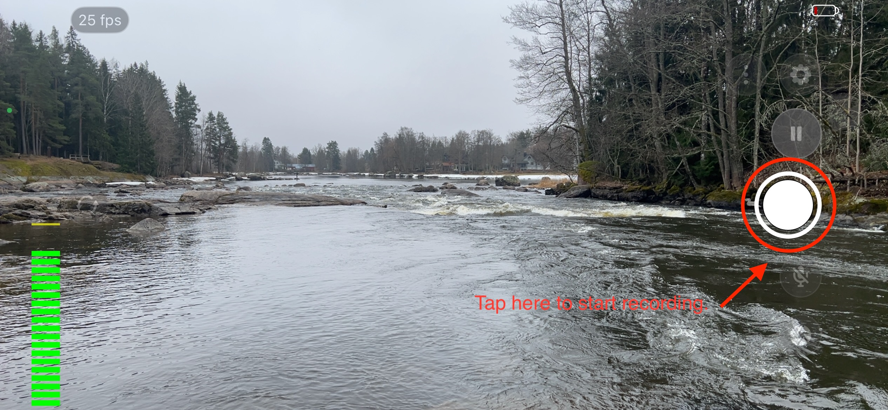
   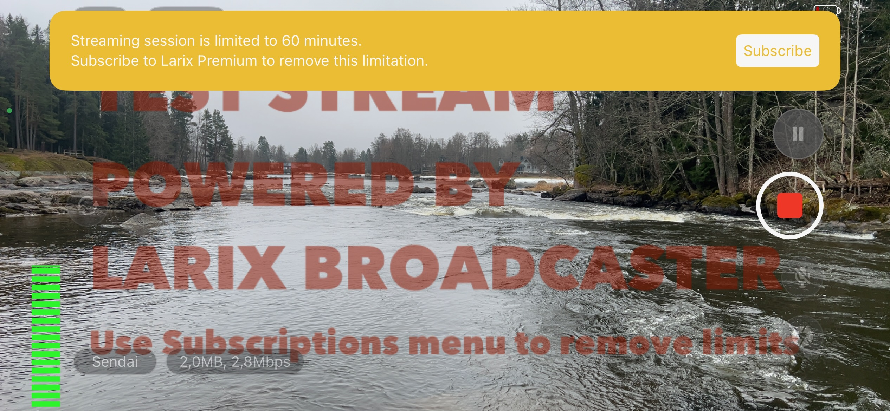
4. Go back to Wowza, and check you "Incoming Streams" now. You should see your stream (+other groups).
   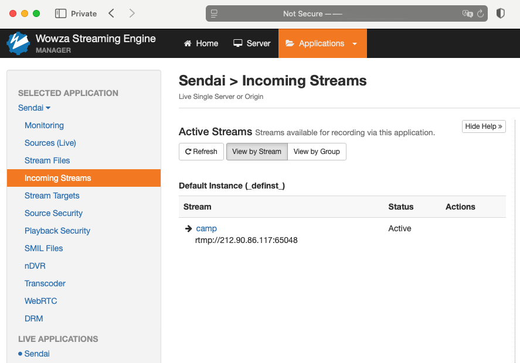
5. To get your Stream URL, press the ”Test Playback” in upper right corner. Set type to HLS and set stream to same name you used in Larix. Copy the URL.
   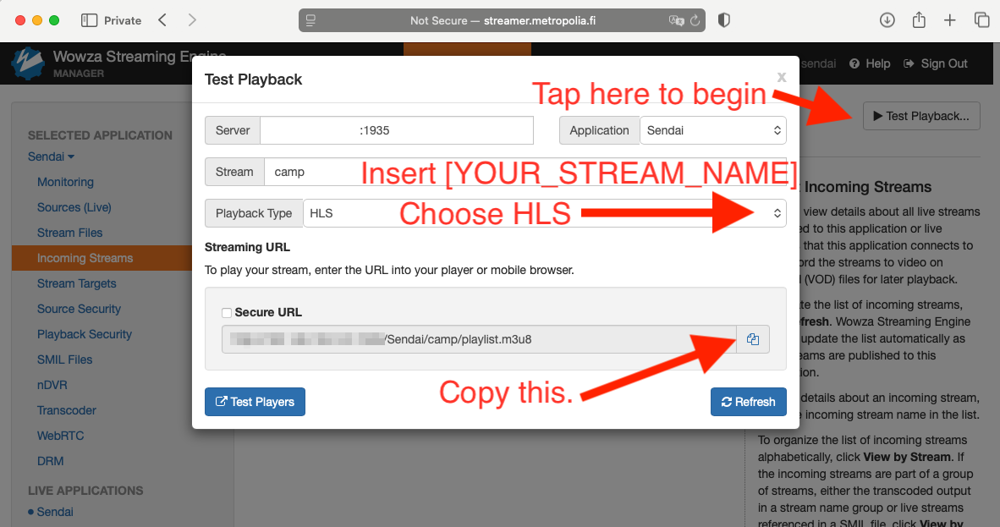
6. Download VLC if you haven’t already. Go to File -> Open Network. Paste your URL and view the stream.
   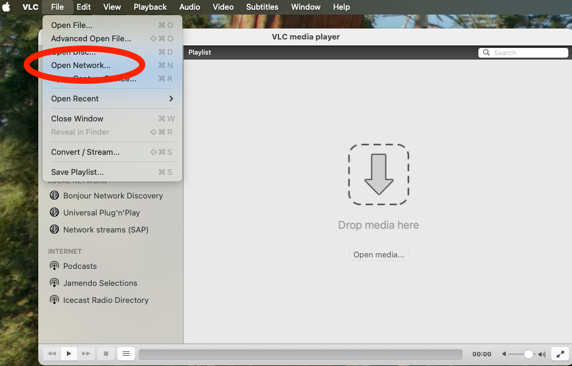
   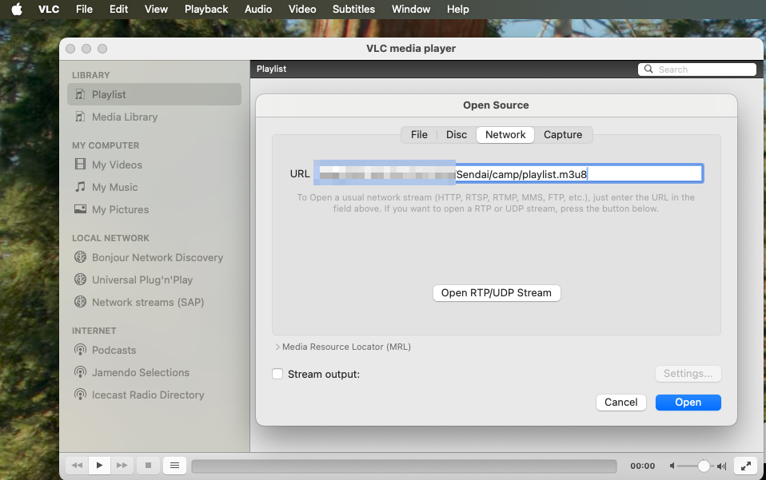

And now you should have your stream going. If you did not succeed, follow back to the beginning to check all the URLs.

### Analysis Questions

- **Latency:** What is the delay of the stream? How would you measure it to get accurate enough reading?
- **Quality:** Observe, how the stream handles motion. Do you see any changes in quality?
- **Viewer** What happens if you open the HLS stream directly in a browser? How did it work?

## Key take-aways

- **Best camera** is the one you have with you.
- **Live streaming pipeline:** Video goes from device → server → multiple clients in different formats.
- **Adaptive quality:** Live video streaming automatically adjusts quality based on network conditions.

## Things to try if you want more challenges

1. **Showing the stream on a website** To show a HLS-stream on a website, you need to use a player for it. Try to implement one, e.g. [VideoJS](https://videojs.org). To complete this, you need basic web development skills.
